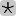

# Konect datasets for DNA

In this repository, we provide scripts to process and analyze dynamic graphs from the **Koblenz Network Collection** (*Konect*) (http://konect.uni-koblenz.de).
We describe how the files are processed and how they are interpreted in DNA for further analysis (https://github.com/BenjaminSchiller/dna).

The implementations for reading and interpreting these datasets in DNA can be found in the following classes:

- *dna.graph.generators.konect.KonectEdge* - represents an edge / line in the dataset
- *dna.graph.generators.konect.KonectReader* - reads a datasets
- *dna.graph.generators.konect.KonectGraph* - generates an initial graph
- *dna.updates.generators.konect.KonectBatch* - generates batches of updates

## Filesystem structure

All datasets are organized as follows:

	datasets/$et/$name

where `$et` is the edge type (see below) and `$name` is the name of the dataset.
Note that these files are not provided as part of this repository.
The *original* files can be obtained from Konect and the others can be generated using the scripts provided here.
For each dataset, the following files are available:

- `$name.html` - original html page containing some statistics and information
- `out.$name` - original dataset
- `README.$name` - original README file with some information about the dataset
- `sorted.$name` - processed dataset (sorted by timestamp)
- `STATS.$name` - stats generated for the dataset

In some cases, additional meta data is included in case it is available on the Konect project page.
So far we have not used any meta data and hece do not list any specifics here.

## Transformation of datasets

When reading a dataset in DNA, we assume that the lines are sorted asceding by timestamp (for performance reasons).
Therefore, we pre-process all files as follows:

	cat $filename | grep -v '%' | sort -g -k4,4 > sorted

In addition, we remove all comments at the beginning of files they start with '%').

## Parsing

The transformed files are read while assuming that each line represents an edge as follows:

	vertex1 vertex2 weight timestamp

In some cases, the entries are not separated by a single space but multiple spaces and/or tabs.
Hence, we split each line (in Java) with the following regex:

	String separator = "\\s+";

## Bipartite / Directed / Undirected Edges

Each Konect datasets is classified as *directed*, *undirected*, or *bipartite*.
We interpret these edges as follows:

- **bipartite** 
	- these graphs are treated as directed graphs
- **directed** 
	- *vertex1* is the source and *vertex2* the destination of the edge
- **undirected** 
	- the order of the vertices is irrelevant

## DNA - Edge Types

In all datasets we fetched and processed for the use with DNA, the timestamp indicates the point in time when an edge appeard / disappeared.
Hence, we only included datasets with timestamped edges here.

Edges can be *directed* or *undirected* and have different interpretations.
We ommit loops that occur in some of the datasets.

We consider 5 different interpretations of edges:
	*ADD*, *ADD_REMOVE*, *MULTI_UNWEIGHTED*, *RATING*, *SIGNED*.
For each type, we briefly describe their meaning and denote what edge weights mean in the resulting graph, which update types are generated, and what parameter the edge type takes.

- **ADD**  
	- edges appear over time
	- timestamp denotes the time of this addition
	- edges are not removed, hence the graph only grows
	- *EDGE WEIGHT*: none
	- *UPDATES*: EA, NA
	- *PARAMETER*: none
- **ADD_REMOVE**  
	- edges appear and disappear over time
	- the weight marks if an edge is added or removed
	- addition: +1, removal: -1
	- we discard edge removals of edges that have not been added yet
	- *EDGE WEIGHT*: none
	- *UPDATES*: EA, NA, ER, (NR)
	- *PARAMETER*: none
- **MULTI**  
	- multiple unweighted edges are added over time
	- when an edge first occurrs, it is initialized with a weight 1
	- for each additional (multi-)edge, the weight is increased
	- the duration of an edge can be specified by the optional parameter
	- then, edges are removed (or their weight decreased) after that time
	- *EDGE WEIGHT*: number of multi-edges
	- *UPDATES*: EA, NA, EW, (ER, NR)
	- *PARAMETER*: duration of edges (optional)
- **WEIGHTED**   and  
	- weighted edges appear over time
	- in case an edge is added again, its weight is simply updated
	- *EDGE WEIGHT*: rating from src to dst
	- *UPDATES*: EA, NA, EW
	- *PARAMETER*: offset (added to each weight), factor (weight is multiplied by)
	- e.g., *p = "3;5" -> *w' = (w + 3) * 5*
	- leaving the parameter empty, i.e., *p = ""*, will use the default ("0;1")

The following parameters can be set for all types (BUT might not be applicable to all types):

- removeZeroDegreeNodes (flag to remove nodes whose edges have all been removed)

## DNA - Graph Types

We consider 4 different types of graphs which determine how many lines / edges to process before initial graph generation is completed:
	*PROCESSED_EDGES* ,*TIMESTAMP*, *TOTAL_EDGES*, *TOTAL_NODES*
Each type takes a single number *p* as parameter whose meaning is descripted below:

- **PROCESSED_EDGES**
	- processes the **first p lines** in the file
- **TIMESTAMP**
	- processes all edges with **timestamp <= p**
- **TOTAL_EDGES**
	- processes edges until **|E| >= p**
- **TOTAL_NODES**
	- processes edges until **|V| >= p**

## DNA - Batch Types

We consider 6 different types of batches which determine how many lines / edges to process before batch generation is completed:
	*BATCH_SIZE*, *EDGE_GROWTH*, *NODE_GROWTH*, *PROCESSED_EDGES*, *TIMESTAMP*, *TIMESTAMPS*.
Each type takes a single parameter *p* as parameter whoose meaning is described below:

- **BATCH_SIZE**
	- process edges until **|B| >= p**
	- *|B|* denotes the total number of updates in the batch
- **EDGE_GROWTH**
	- process edges until **|B.EA| - |B.ER| >= p**
	- *|B.EA|* denotes the number of edge addition in the batch
	- *|B.ER|* denotes the number of edge removals in the batch
- **NODE_GROWTH**
	- process edges until **|B.NA| - |B.NR| >= p**
	- *|B.NA|* denotes the number of node addition in the batch
	- *|B.NR|* denotes the number of node removals in the batch
- **PROCESSED_EDGES**
	- processes the **next p lines** in the file
- **TIMESTAMP**
	- process all edges with **timestamp <= G.timestamp + p**
	- *G.timestamp* denotes the current timestamp of the graph
- **TIMESTAMPS**
	- here, *p* is assumed to denote a list of timestamps separated by ";"
	- e.g., *p = "123;500;720;1340"*
	- edges are processed with **timestamp <= p'**
	- where *p'* is taken one after the other from *p*

## Examples

In the following, we give some examples how graph and batch generator can be parametrized with the respective edge, graph, and batch types.

	